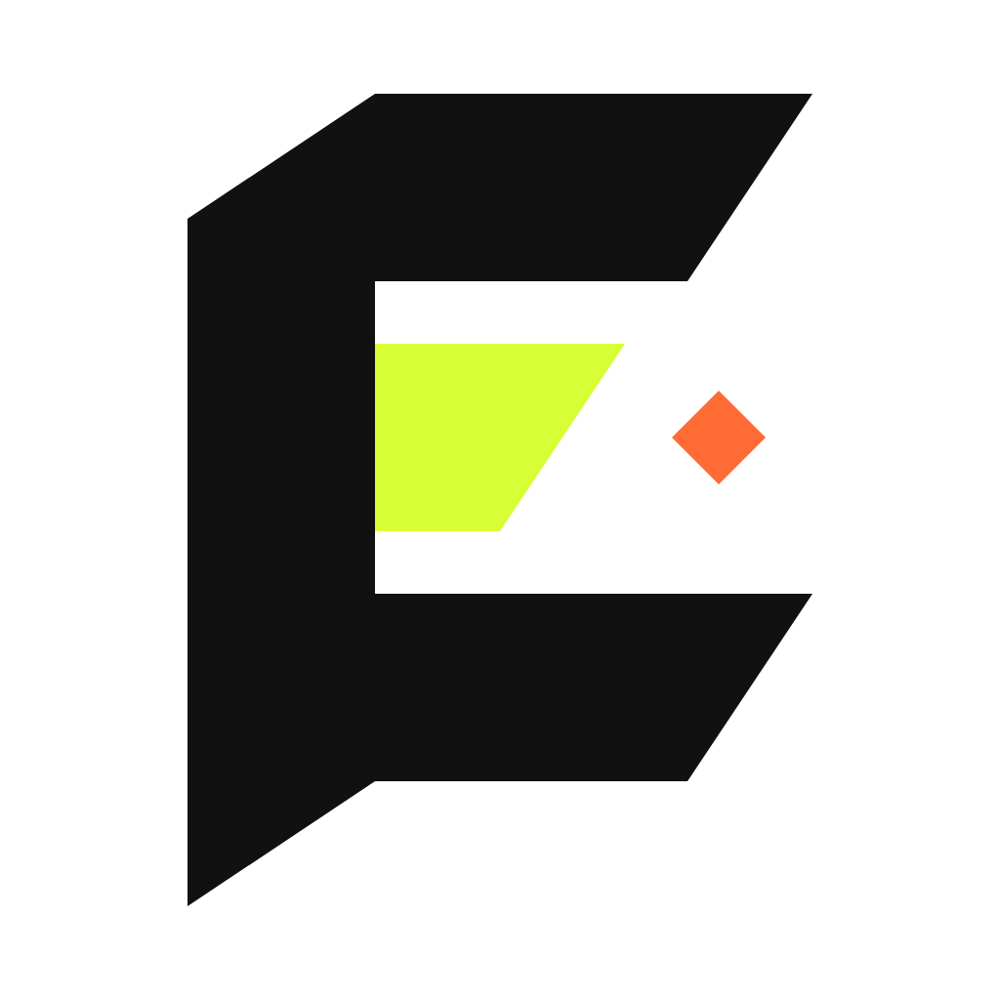

# Eridian

> Local-first sketching with a sharper little edge.

**Eridian** is a premium, minimalist sketch workspace designed for focused drawing and visual thinking. Built on top of Excalidraw, it provides a "brutalist" refined interface that prioritizes speed, local privacy, and a tactile digital feel.



## ✨ Features

- **Local-First & Private**: Your drawings stay on your machine. Data is persisted locally using SQLite on desktop and localStorage/IndexedDB on the web.
- **Seamless Desktop Experience**: A native Electron app for Windows, macOS, and Linux with a dedicated title bar and deep system integration.
- **Brutalist Aesthetic**: A curated "paper" texture (#f4f1e8) and a sharp, high-contrast UI that feels like a professional drafting tool.
- **Advanced Embeds**: Effortlessly embed YouTube videos, Figma files, Reddit threads, and X (Twitter) posts directly into your workspace.
- **Desktop Webviews**: On the desktop app, embeds use native `webview` tags for better performance and isolated sessions.
- **Installable PWA**: Take your workspace offline with full PWA support on mobile and desktop browsers.
- **Auto-Save**: Never worry about losing work. Every stroke is captured and saved in real-time.

## 🚀 Tech Stack

- **Framework**: [Next.js 15+](https://nextjs.org) (App Router, Turbopack)
- **Canvas Engine**: [Excalidraw](https://excalidraw.com)
- **Desktop**: [Electron](https://www.electronjs.org/)
- **Database**: Node.js 22 `DatabaseSync` (SQLite)
- **Styling**: Vanilla CSS + Tailwind CSS
- **Package Manager**: `pnpm`

## 🛠️ Getting Started

### Prerequisites

- [Node.js 22+](https://nodejs.org) (Required for native SQLite support)
- [pnpm](https://pnpm.io)

### Installation

```bash
# Clone the repository
git clone https://github.com/your-repo/eridian.git
cd eridian

# Install dependencies
pnpm install
```

### Development

Run the web version in development mode:
```bash
pnpm run dev
```

Run the desktop version in development mode:
```bash
pnpm run desktop
```

## 📦 Building for Desktop

Eridian is configured for multi-platform distribution using `electron-builder`.

| Platform | Command | Output |
| :--- | :--- | :--- |
| **Current OS** | `pnpm run dist` | Current system installer |
| **Windows** | `pnpm run dist:win` | `.exe` (Portable & NSIS) |
| **macOS** | `pnpm run dist:mac` | `.dmg` & `.zip` |
| **Linux** | `pnpm run dist:linux` | `.AppImage` & `.deb` |

*Note: Building for macOS requires a macOS environment.*

## 🎨 Visual Identity

- **Primary Colors**: 
  - Paper: `#f4f1e8`
  - Glyph (Lime): `#d8ff35`
  - Signal (Orange): `#ff6b35`
  - Ink: `#111111`
- **Typography**: Geist Sans & Geist Mono

## 📂 Project Structure

- `app/`: Next.js application routes and logic.
- `components/`: React components, including the main `Sketchboard`.
- `electron/`: Electron main process, preload scripts, and desktop-specific logic.
- `public/`: Static assets and icons.
- `scripts/`: Build and preparation scripts.

## 📄 License

Internal Project / All Rights Reserved.

---

Built with ❤️ for thinkers and creators.
